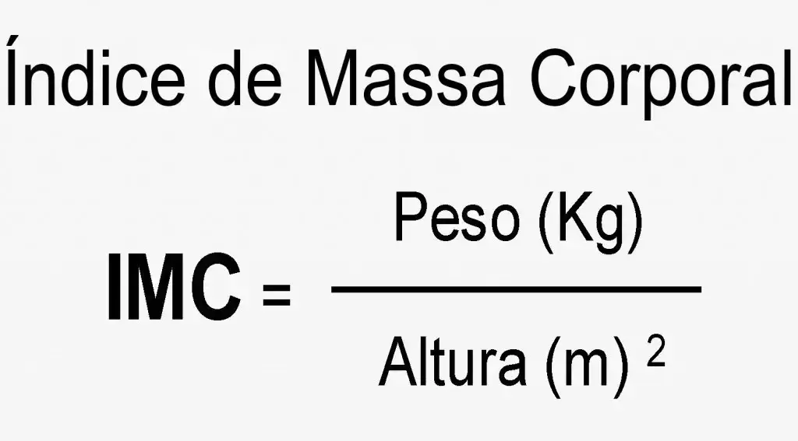

#  Calculadora IMC 🏋️‍♂️

Este é um projeto de uma simples *Calculadora IMC* desenvolvido utilizando **HTML**, **CSS** e **JavaScript**.💻✨

## 🚀 Tecnologias Utilizadas

- **HTML**: Estrutura básica da página
- **CSS**: Estilos para a aparência da interface, incluindo layout, cores e animações.
- **JavaScript**: Lógica para realizar o cálculo corretamente.

## 🌐 Acesse Aqui

Você pode acessar  o Jogo da Velha através deste [link](https://marcellofigueiredo.github.io/imc-calculator/). Basta abrir no seu navegador e começar a usar!

